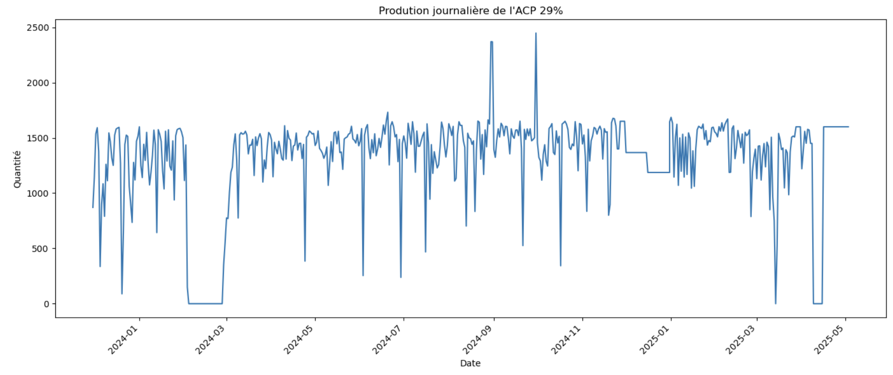
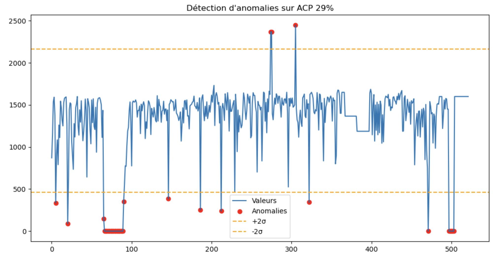
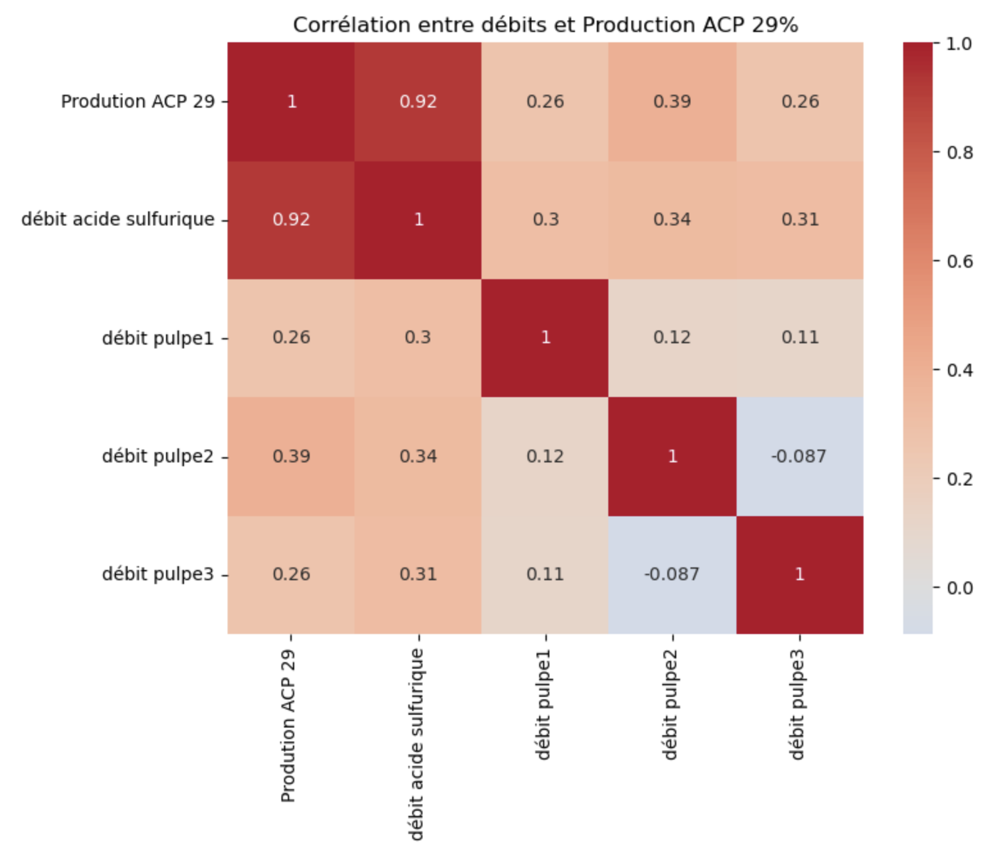
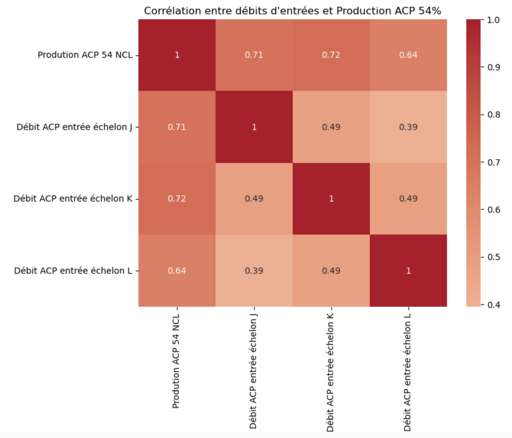
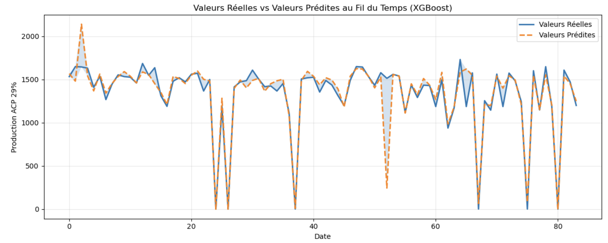
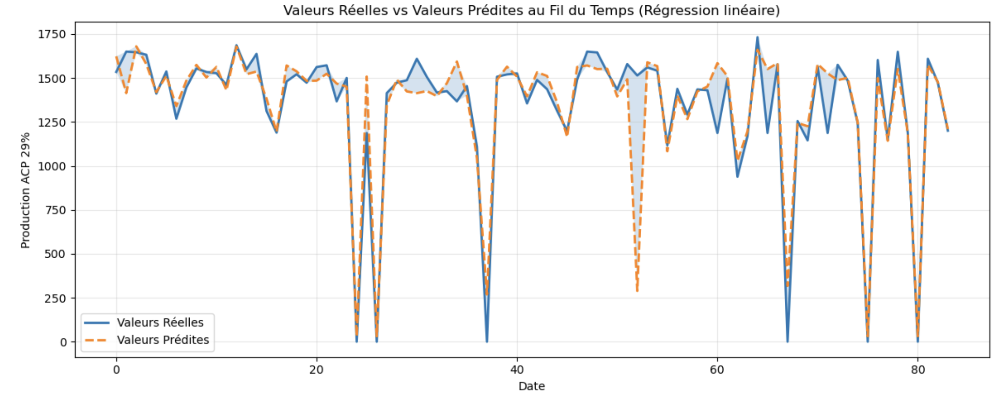

# Modélisation Prédictive de la Production d'Acide Phosphorique

> Stage d'été — **OCP Group · Jorf Lasfar** · INSEA · 2024/2025

Développement d'un modèle de Machine Learning pour prédire la production journalière d'acide phosphorique (titres **29 %** et **54 %**) à partir des débits d'entrée mesurés sur les unités industrielles de **JFC 5**.

---

## Contexte

L'**OCP Group**, leader mondial du phosphate, transforme à Jorf Lasfar le minerai phosphaté en acide phosphorique et en engrais. Anticiper la production journalière permet de **mieux piloter le procédé**, de **détecter les anomalies** et de **soutenir la prise de décision opérationnelle** — un enjeu central de la stratégie *Advanced Analytics* du groupe.

Ce projet s'inscrit dans cette démarche en construisant un modèle de régression capable d'estimer la production à partir des débits d'acide sulfurique et de pulpe phosphatée.

---

## Stack technique

`Python` · `pandas` · `scikit-learn` · `XGBoost` · `statsmodels` · `matplotlib` · `seaborn` · `Jupyter`

---

## Démarche

1. **Préparation des données** — agrégation des débits horaires en journées (la journée OCP commence à 7h00) et fusion avec la production journalière
2. **Analyse exploratoire** — statistiques descriptives, décomposition saisonnière (tendance / saisonnalité / résidus)
3. **Détection d'anomalies** — méthode statistique basée sur l'écart-type (±2σ)
4. **Analyse de corrélation** — identification des variables les plus prédictives
5. **Modélisation comparative** — Régression Linéaire Multiple vs Random Forest vs XGBoost
6. **Évaluation** — R² et RMSE sur un jeu de test (split 80/20)

---

## Aperçu visuel

### Évolution de la production ACP 29 %

### Détection d'anomalies (méthode ±2σ)

### Corrélations — ACP 29 %
Le débit d'acide sulfurique présente une corrélation très forte (**0.92**) avec la production.

### Corrélations — ACP 54 %
Les trois échelons (J, K, L) sont tous fortement corrélés à la production.

### Prédictions du modèle final (XGBoost) — ACP 29 %

### Comparaison avec Random Forest

---

## Résultats

### ACP 29 %

| Modèle | R² | RMSE |
|---|---:|---:|
| Régression Linéaire Multiple | 0.815 | 173.43 |
| Random Forest | 0.822 | 170.02 |
| **XGBoost** | **0.826** | **168.29** |

### ACP 54 %

| Modèle | R² | RMSE |
|---|---:|---:|
| Régression Linéaire Multiple | 0.734 | 169.11 |
| Random Forest | 0.850 | 126.95 |
| **XGBoost** | **0.858** | **123.76** |

**Modèle retenu : XGBoost** pour les deux titres, offrant le meilleur compromis précision / capacité de généralisation.

---

## Confidentialité des données

Les données utilisées dans ce projet sont la **propriété confidentielle d'OCP Group** et ne peuvent être partagées publiquement. Le repository contient uniquement la **méthodologie** et les **visualisations**.

---

## Auteur

**Houda MOURADI** — Élève ingénieure, INSEA
